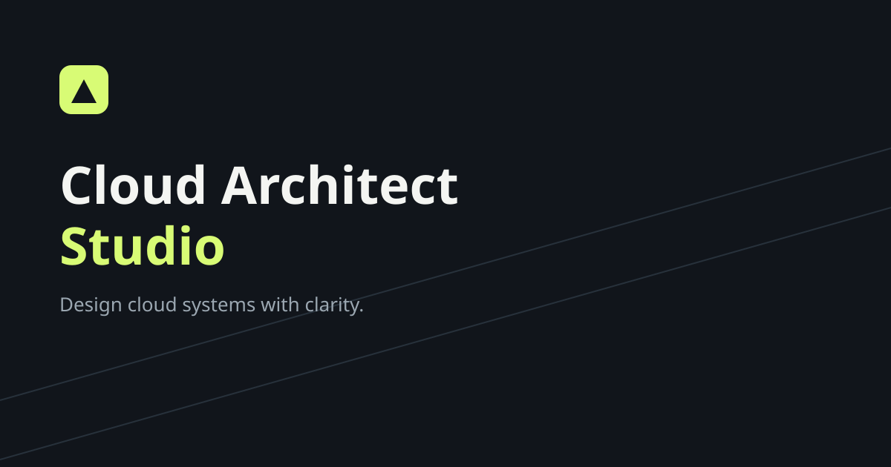
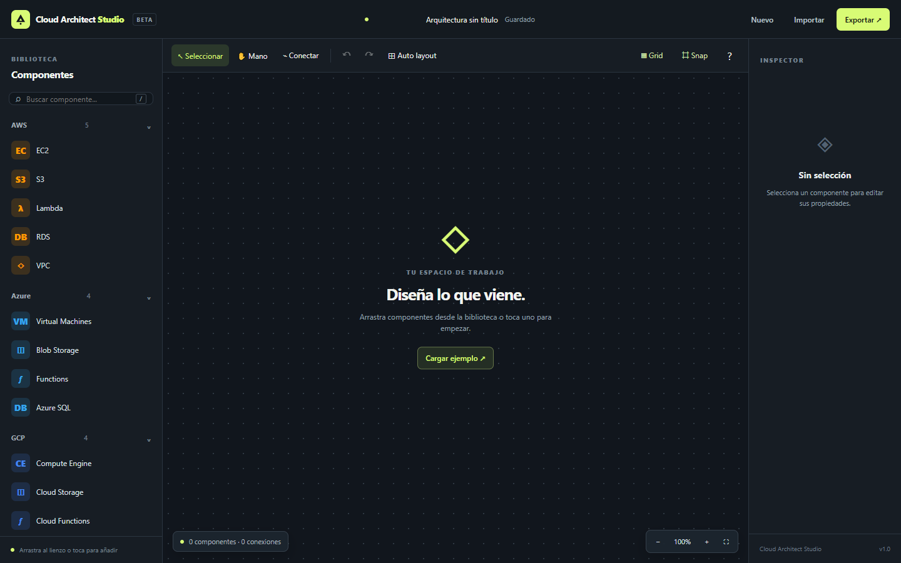
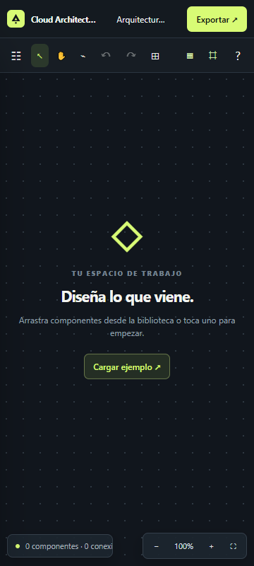
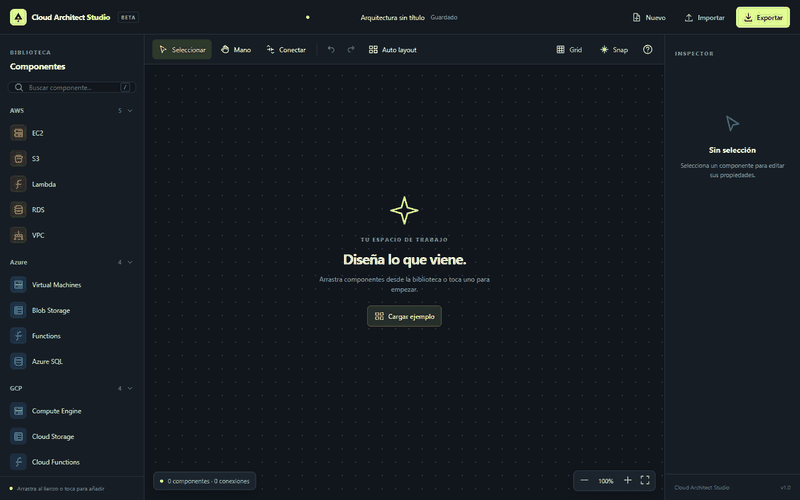
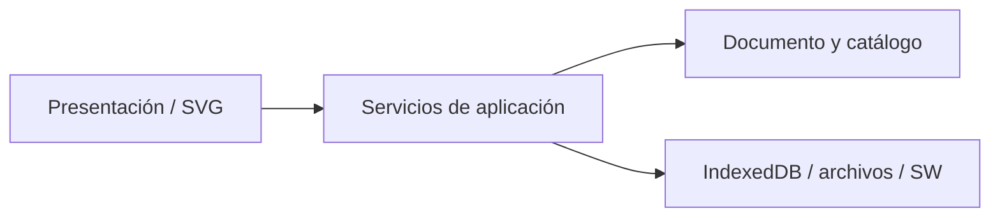
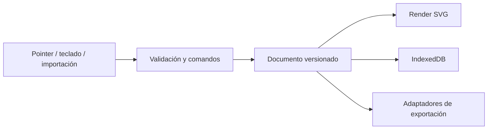

<div align="center">


# Cloud Architect Studio

**Diseña arquitecturas cloud con claridad.**

Editor visual, privado y sin conexión. HTML, CSS y JavaScript nativos; listo para GitHub Pages.

   



</div>

## Demo online

URL prevista según el remoto Git actual: [Cloud Architect Studio](https://analizajech.github.io/cloud-architect-studio/). La publicación todavía debe habilitarse en GitHub Pages.

## Capturas y GIFs

Capturas reales de la aplicación en un servidor local:

| Escritorio                                | Móvil (360 px)                      |
| ----------------------------------------- | ----------------------------------- |
|  |  |



El GIF alterna dos capturas reales del editor: el lienzo vacío y el ejemplo cargado.

## Características

- Biblioteca de 33 componentes de AWS, Azure, GCP, GitHub, GitLab, Kubernetes, Docker, Terraform, ArgoCD, Jenkins, Port, Backstage, n8n, Kafka, Redis, PostgreSQL, MongoDB, RabbitMQ, Grafana, Prometheus, Loki, Tempo y OpenTelemetry.
- Arrastrar y soltar con mouse; tocar para colocar con teclado o pantalla táctil.
- Conexiones entre componentes, inspector, auto layout, cuadrícula, snap, zoom de 2 % a 3200 %, pan, undo y redo.
- Exportación SVG, PNG, Draw.io, Mermaid, PlantUML y JSON. PDF mediante el diálogo de impresión del navegador.
- Guardado local automático con IndexedDB y respaldo en localStorage.
- PWA instalable y funcional sin conexión después de la primera visita.
- Interfaz oscura adaptable, estados de foco y controles etiquetados.

## Tecnologías

HTML5, CSS3, JavaScript ES2025, SVG, IndexedDB, Service Worker y Web App Manifest. No se requieren librerías de ejecución, Node ni backend.

## Instalación y desarrollo

Clona o descarga el repositorio. Abre un servidor estático desde la raíz:

```bash
python -m http.server 8000
```

Visita `http://localhost:8000/`. Los módulos JavaScript y el Service Worker requieren HTTP local o HTTPS; abrir `index.html` directamente como archivo puede impedir su carga.

## Uso

1. Arrastra un componente desde la biblioteca al lienzo, o selecciónalo para colocarlo en el centro.
2. Activa **Conectar** y selecciona origen y destino.
3. Mueve componentes, edita nombres en el inspector y usa **Auto layout** cuando sea útil.
4. Exporta el diagrama. Usa JSON para conservar una copia editable e importarla después.

### Atajos

| Acción                         | Atajo                     |
| ------------------------------ | ------------------------- |
| Seleccionar / mover / conectar | `V` / `H` / `C`           |
| Deshacer / rehacer             | `Ctrl+Z` / `Ctrl+Shift+Z` |
| Buscar componente              | `/`                       |
| Mostrar cuadrícula             | `G`                       |
| Acercar / alejar               | `+` / `-`                 |
| Eliminar selección             | `Supr`                    |
| Exportar JSON                  | `Ctrl+S`                  |

En macOS, usa `⌘` en lugar de `Ctrl`.

## Arquitectura

Consulta [la descripción completa](docs/ARCHITECTURE.md). Las dependencias apuntan hacia el dominio y las exportaciones usan el mismo documento versionado.



### Flujo de datos



### Estructura de carpetas

```text
assets/       Identidad visual y medios
css/          Tokens, diseño adaptable y estados
js/app.js     Composición de la aplicación
js/components/  Componentes DOM y SVG
js/modules/     Dominio y catálogo
js/services/    Historial, persistencia y exportación
js/utils/       Escapado y descargas
js/hooks/       Atajos e interacciones
components/ modules/ services/ utils/ hooks/  Espacios para recursos futuros
icons/        Logo y pictogramas PWA
fonts/        Política de tipografía
docs/         Arquitectura y material de proyecto
examples/     Diagramas de ejemplo
```

## Deploy en GitHub Pages

1. Publica los archivos en la raíz de un repositorio GitHub.
2. En **Settings → Pages**, selecciona **Deploy from a branch**, rama `main`, carpeta `/ (root)`.
3. Espera la URL `https://analizajech.github.io/cloud-architect-studio/`.
4. Si cambias el propietario o repositorio, actualiza `sitemap.xml`, `robots.txt`, los metadatos de `index.html` y la sección **Demo online**.
5. Comprueba instalación PWA, carga sin conexión e importación/exportación desde la URL publicada.

Todas las rutas son relativas y funcionan bajo un subdirectorio de GitHub Pages.

## Performance y benchmark

| Métrica                   | Resultado local             |
| ------------------------- | --------------------------- |
| Dependencias de ejecución | 0                           |
| Build obligatorio         | Ninguno                     |
| Carga offline             | Service Worker con precache |
| Lighthouse Performance    | **99**                      |
| Lighthouse Accessibility  | **100**                     |
| Lighthouse Best Practices | **100**                     |
| Lighthouse SEO            | **100**                     |

Medición: Lighthouse 12.8.2, Chrome headless, `http://localhost:8765/`, 24 de septiembre de 2026. [Informe JSON completo](docs/lighthouse-local.json). Estos números describen esa ejecución local; comprueba la URL publicada para medir el rendimiento real de GitHub Pages. Para grafos muy grandes, el siguiente paso es renderizado incremental y virtualización.

## Accesibilidad

Incluye salto al contenido, navegación de controles mediante teclado, movimiento de nodos con flechas, conexión mediante la herramienta y Enter, etiquetas para acciones, estados `aria-pressed`, foco visible y preferencia de movimiento reducido. El objetivo es WCAG 2.2 AA; se recomienda una auditoría con teclado, lector de pantalla y axe/Lighthouse sobre el sitio desplegado.

## Seguridad y privacidad

La app no transmite diagramas. El contenido importado se valida y el texto se inserta con APIs DOM seguras o se escapa para XML. CSP restringe scripts, estilos y recursos a la misma fuente. Consulta [SECURITY.md](SECURITY.md).

## Roadmap

- Movimiento y creación de conexiones desde el lienzo mediante teclado.
- Grupos, contenedores y formas personalizadas.
- Iconografía oficial con licencias verificadas por proveedor.
- Layout incremental para grafos grandes y guías de alineación.
- Exportación PDF directa mediante una librería evaluada por tamaño y licencia.
- Tests automatizados de accesibilidad y de formatos de exportación.

## FAQ

**¿Necesito cuenta?** No. Los diagramas se guardan en tu navegador.

**¿Se sincronizan mis diagramas?** No. Exporta JSON para transferirlos o respaldarlos.

**¿Por qué PDF abre una ventana de impresión?** El navegador permite guardar como PDF vectorial sin añadir una librería pesada.

**¿Funciona sin conexión desde el primer momento?** Necesita una primera visita con conexión para guardar el shell de la PWA.

## Troubleshooting

- **Pantalla vacía al abrir un archivo local:** usa un servidor HTTP local.
- **PWA sin instalación:** comprueba HTTPS, manifiesto, iconos PNG y compatibilidad del navegador.
- **Cambios antiguos tras desplegar:** cierra pestañas existentes y recarga. Incrementa la versión de caché en `sw.js` al publicar cambios.
- **Datos locales perdidos:** el almacenamiento del navegador puede limpiarse; exporta JSON periódicamente.

## Contribuciones, créditos y licencia

Lee [CONTRIBUTING.md](CONTRIBUTING.md) y [CODE_OF_CONDUCT.md](CODE_OF_CONDUCT.md). Cloud Architect Studio se inspira en patrones de edición de draw.io, Lucidchart y Figma; no usa su código ni sus activos. Los nombres de proveedores pertenecen a sus respectivos titulares.

Licencia [MIT](LICENSE). Historial en [CHANGELOG.md](CHANGELOG.md).
