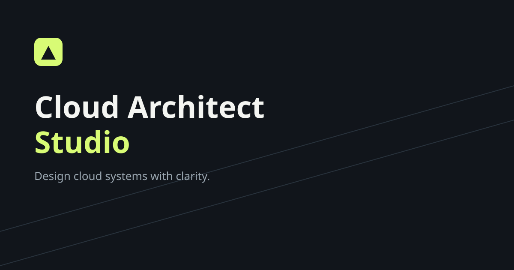
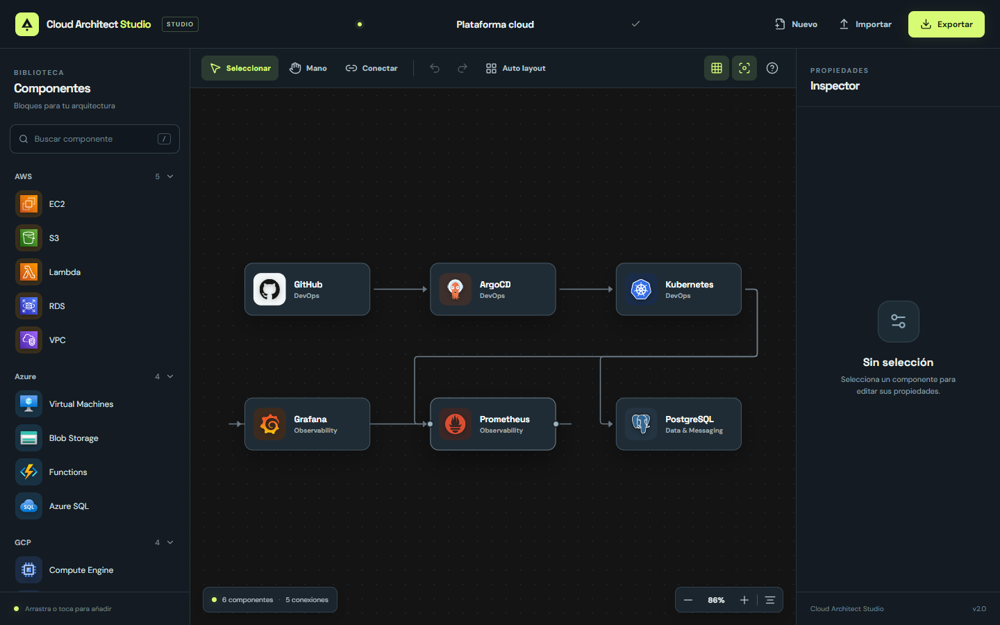
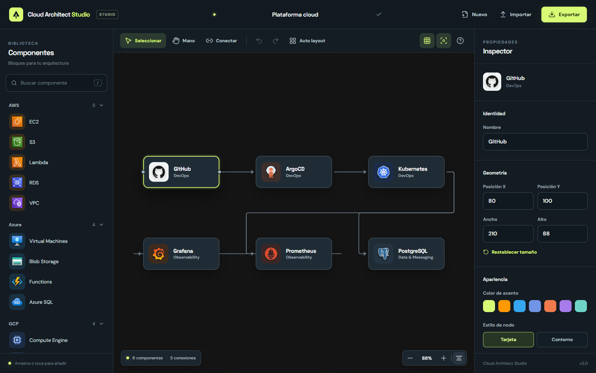
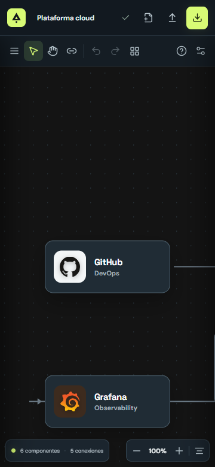
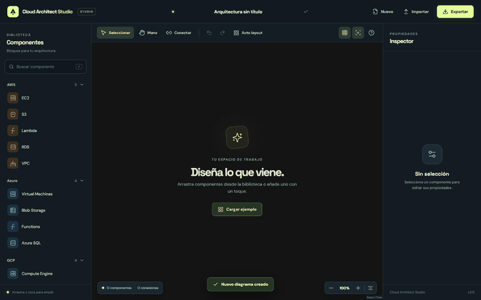
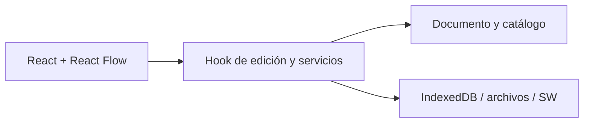
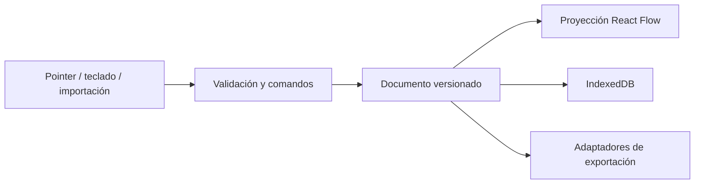

<div align="center">


# Cloud Architect Studio

**Diseña arquitecturas cloud con claridad.**

Editor visual, privado y sin conexión. React, TypeScript y React Flow; publicado como archivos estáticos en GitHub Pages.

   



</div>

## Demo online

Sitio publicado: [Cloud Architect Studio](https://analizajech.github.io/cloud-architect-studio/). Los cambios de este repositorio requieren una nueva publicación para aparecer allí.

## Capturas y GIFs

Capturas de la versión 2.0 actual, tomadas en el navegador sobre el build de producción:

| Escritorio                                | Móvil (360 px)                      |
| ----------------------------------------- | ----------------------------------- |
|  |  |







El GIF alterna el lienzo vacío y el diagrama de ejemplo con los iconos SVG actuales.

## Características

- Biblioteca de 33 componentes de AWS, Azure, GCP, GitHub, GitLab, Kubernetes, Docker, Terraform, ArgoCD, Jenkins, Port, Backstage, n8n, Kafka, Redis, PostgreSQL, MongoDB, RabbitMQ, Grafana, Prometheus, Loki, Tempo y OpenTelemetry.
- Iconos SVG específicos para las 33 tecnologías en la biblioteca, los nodos y las exportaciones visuales; disponibles sin conexión. Los controles usan iconos Lucide. [Fuentes y condiciones de uso](docs/ICONS.md).
- Arrastrar y soltar con mouse; tocar para colocar con teclado o pantalla táctil.
- Cuatro puntos de conexión por componente: arrastrar entre puntos o seleccionar origen y destino con dos clics. El lado elegido se conserva al guardar y exportar SVG.
- Inspector, auto layout, cuadrícula, snap, zoom de 2 % a 3200 %, pan, undo y redo.
- Personalización por nodo: nombre, posición, ancho, alto, color y estilo de tarjeta o contorno. Los diagramas JSON antiguos siguen siendo compatibles.
- Exportación SVG, PNG, Draw.io, Mermaid, PlantUML y JSON. PDF mediante el diálogo de impresión del navegador.
- Guardado local automático con IndexedDB y respaldo en localStorage.
- PWA instalable y funcional sin conexión después de la primera visita.
- Interfaz oscura adaptable, estados de foco y controles etiquetados.

## Tecnologías

React 19, TypeScript, Vite, React Flow, Lucide SVG, CSS, IndexedDB y vite-plugin-pwa. No hay backend; Node se usa para desarrollar y generar los archivos estáticos.

La marca visual de React Flow está oculta en el lienzo para dejar libre el espacio de trabajo. React Flow sigue reconocido aquí y en las dependencias del proyecto.

## Instalación y desarrollo

Clona el repositorio e instala las dependencias:

```bash
npm ci
npm run dev
```

Abre la URL mostrada por Vite. `index.html` ya no se ejecuta directamente con `file://`; debe compilarse o servirse con Vite.

Pruebas y compilación de producción:

```bash
npm test
npm run build
npm run preview
```

## Uso

1. Arrastra un componente desde la biblioteca al lienzo, o selecciónalo para colocarlo en el centro.
2. Pasa el cursor por un componente y arrastra desde cualquiera de sus cuatro puntos hasta otro componente. También puedes hacer clic en el punto de origen y luego en el de destino. **Conectar** mantiene visibles todos los puntos mientras diseñas.
3. Mueve componentes, ajusta tamaño y apariencia en el inspector y usa **Auto layout** cuando sea útil.
4. Exporta el diagrama. Usa JSON para conservar una copia editable e importarla después.

### Atajos

| Acción                         | Atajo                     |
| ------------------------------ | ------------------------- |
| Seleccionar / mover / conectar | `V` / `H` / `C`           |
| Deshacer / rehacer             | `Ctrl+Z` / `Ctrl+Shift+Z` |
| Buscar componente              | `/`                       |
| Eliminar selección             | `Supr`                    |
| Duplicar componente            | `Ctrl+D`                  |

En macOS, usa `⌘` en lugar de `Ctrl`.

## Arquitectura

Consulta [la arquitectura de migración](docs/MIGRATION_ARCHITECTURE.md). El modelo de documento v1 y la clave de IndexedDB siguen siendo compatibles con la versión anterior.


```mermaid
flowchart LR
  UI[React + React Flow] --> APP[Hook de edición y servicios]
  APP --> DOMAIN[Documento y catálogo]
  APP --> PLATFORM[IndexedDB / archivos / SW]
```

### Flujo de datos


```mermaid
flowchart LR
  INPUT[Pointer / teclado / importación] --> VALIDATE[Validación y comandos]
  VALIDATE --> DOC[Documento versionado]
  DOC --> VIEW[Proyección React Flow]
  DOC --> SAVE[IndexedDB]
  DOC --> EXPORT[Adaptadores de exportación]
```

### Estructura de carpetas

```text
src/          Componentes React, estado y diseño visual
js/modules/   Dominio, geometría y catálogo compatibles con v1
js/services/  Persistencia y adaptadores de exportación
js/utils/     Escapado y descargas
public/       Iconos, metadatos y medios estáticos
docs/         Arquitectura y material de proyecto
examples/     Diagramas de ejemplo
tests/        Pruebas de compatibilidad, geometría y exportación
dist/         Salida generada por Vite; no se versiona
```

## Deploy en GitHub Pages

1. En **Settings → Pages**, selecciona **GitHub Actions** como fuente de publicación.
2. Al publicar `master`, el flujo `.github/workflows/deploy.yml` ejecuta tests, compila y sube `dist/`.
3. Abre `https://analizajech.github.io/cloud-architect-studio/` y comprueba carga, PWA e importación/exportación.
4. Si cambias el nombre del repositorio, actualiza `base` en `vite.config.ts`, los metadatos y las URLs de `public/robots.txt` y `public/sitemap.xml`.

Vite configura las rutas del proyecto para `/cloud-architect-studio/`. Los usuarios finales reciben solo archivos estáticos.

## Performance y benchmark

| Métrica                   | Resultado local             |
| ------------------------- | --------------------------- |
| Build de producción       | Vite + TypeScript           |
| Carga offline             | PWA con precache versionado |
| Lighthouse local: rendimiento | **97** |
| Lighthouse local: accesibilidad | **100** |
| Lighthouse local: prácticas recomendadas | **96** |
| Lighthouse local: SEO | **100** |

Medición del build v2 con Lighthouse 12.8.2 en Chrome headless y Vite Preview local, 1 de octubre de 2026: [informe JSON](docs/lighthouse-v2-local.json). La [medición anterior](docs/lighthouse-local.json) corresponde a la versión 1. Los resultados de la URL publicada pueden variar. Para grafos muy grandes, el siguiente paso es virtualización.

## Accesibilidad

Incluye salto al contenido, controles con etiquetas, foco visible, atajos, estados `aria-pressed` y preferencia de movimiento reducido. El objetivo es WCAG 2.2 AA; quedan por verificar en detalle el manejo de foco de los diálogos y la edición del lienzo con lector de pantalla.

## Seguridad y privacidad

La app no transmite diagramas. El contenido importado se valida y el texto se escapa para XML. La CSP mantiene scripts y recursos en el mismo origen; permite estilos inline necesarios para las posiciones dinámicas de React Flow. Consulta [SECURITY.md](SECURITY.md).

## Roadmap

- Movimiento y creación de conexiones desde el lienzo mediante teclado.
- Grupos, contenedores y formas personalizadas.
- Iconografía oficial con licencias verificadas por proveedor.
- Layout incremental para grafos grandes y guías de alineación.
- Exportación PDF directa mediante una librería evaluada por tamaño y licencia.
- Tests automatizados de accesibilidad y de formatos de exportación.

## FAQ

**¿Necesito cuenta?** No. Los diagramas se guardan en tu navegador.

**¿Se sincronizan mis diagramas?** No. Exporta JSON para transferirlos o respaldarlos.

**¿Por qué PDF abre una ventana de impresión?** El navegador permite guardar como PDF vectorial sin añadir una librería pesada.

**¿Funciona sin conexión desde el primer momento?** Necesita una primera visita con conexión para guardar el shell de la PWA.

## Troubleshooting

- **Pantalla vacía al abrir `index.html` con `file://`:** esta versión requiere `npm run dev` o los archivos compilados de `npm run build` servidos por HTTP.
- **PWA sin instalación:** comprueba HTTPS, manifiesto, iconos PNG y compatibilidad del navegador.
- **Cambios antiguos tras desplegar:** cierra pestañas existentes y recarga. La PWA generada por Vite versiona automáticamente sus activos.
- **Datos locales perdidos:** el almacenamiento del navegador puede limpiarse; exporta JSON periódicamente.

## Contribuciones, créditos y licencia

Lee [CONTRIBUTING.md](CONTRIBUTING.md) y [CODE_OF_CONDUCT.md](CODE_OF_CONDUCT.md). Cloud Architect Studio se inspira en patrones de edición de draw.io, Lucidchart y Figma; no usa su código ni sus activos. Los nombres de proveedores pertenecen a sus respectivos titulares.

Licencia [MIT](LICENSE). Historial en [CHANGELOG.md](CHANGELOG.md).
