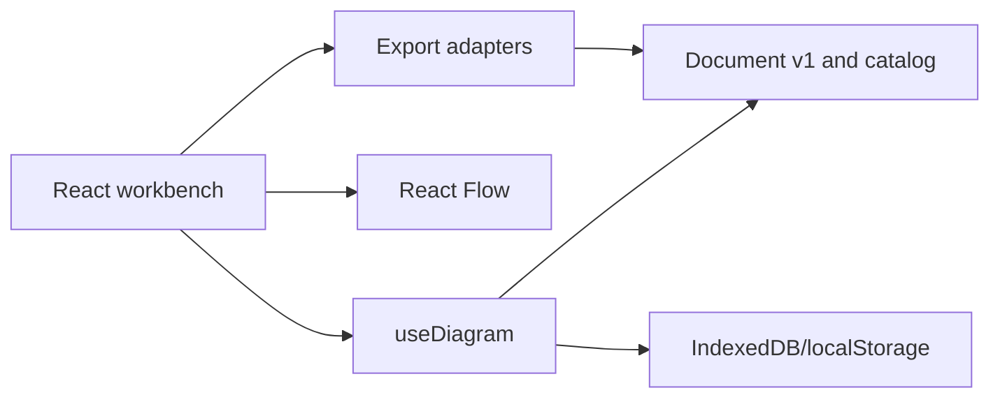

# Architecture — Cloud Architect Studio

Cloud Architect Studio is a client-only editor. Vite compiles the React application into static files for GitHub Pages. See [the migration decisions](MIGRATION_ARCHITECTURE.md) for the boundaries and visual direction.

## Dependency direction



The `DiagramDocument` version 1 schema remains the canonical source of truth. React Flow receives projected nodes and edges and sends edits back to this schema. This preserves existing JSON files, IndexedDB records and exports. The domain modules do not import React.

## Document contract

```json
{
  "version": 1,
  "title": "Arquitectura sin título",
  "nodes": [{ "id": "n1", "type": "aws-ec2", "label": "EC2", "x": 120, "y": 80, "width": 210, "height": 88, "color": "#ff9900", "variant": "card" }],
  "edges": []
}
```

Coordinates and dimensions are logical canvas pixels. Import normalizes legacy records and rejects invalid node types, duplicate IDs and dangling edges. Discrete edits push bounded history snapshots; a drag gesture records one snapshot at its end.

Edges may include `fromHandle` and `toHandle` with one of `left`, `right`, `top` or `bottom`. The four React Flow handles operate in loose connection mode so any visible point can start or end a connection. Older edges without handles use the nearest sides when rendered; import discards invalid handle names. SVG export uses the saved sides.

## Persistence and export

Autosave writes the document to the existing IndexedDB database and key, with localStorage as a fallback. Export adapters generate SVG, PNG, PDF via print, Draw.io, Mermaid, PlantUML and JSON from the same document. The service worker is generated at build time and precaches versioned assets.

## Deployment

`vite.config.ts` sets the GitHub Pages project base path. GitHub Actions runs tests and the production build, then publishes `dist/`. Browser execution needs neither Node nor a backend. Local development uses `npm run dev`; `file://index.html` is unsupported.

## Accessibility and security

Controls have labels and visible focus. HTML semantics remain in use even though visual controls are custom styled. Untrusted document data is validated; exported XML escapes text. The CSP blocks external scripts and allows inline styles for graph positioning. The React Flow canvas requires additional keyboard and screen reader auditing before claiming WCAG 2.2 AA conformance.
