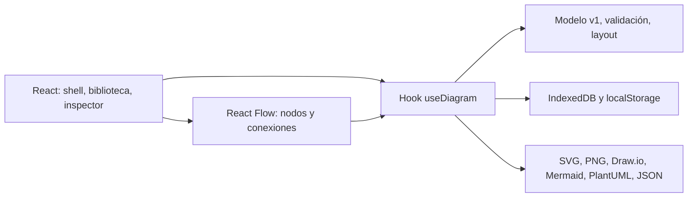

# Arquitectura de la migración

## Objetivo

Mantener el contrato `DiagramDocument` versión 1, las 33 entradas del catálogo, IndexedDB, las exportaciones y el despliegue estático. Sustituir la capa de interacción del lienzo por React Flow y la interfaz por componentes React.

## Capas

- `src/`: presentación, adaptadores React Flow y estado de edición.
- `js/modules/`, `js/services/`, `js/components/icons.js`: dominio y servicios existentes, independientes de React.
- `public/`: manifest, iconos, metadatos y recursos servidos sin transformación.
- `dist/`: salida estática de Vite para GitHub Pages.

## Decisiones

1. El documento v1 sigue siendo la fuente de verdad. Los nodos y conexiones de React Flow son una proyección; así continúan funcionando importación y exportación sin migrar datos del usuario.
2. Los cambios discretos se registran en una pila de historial. Arrastrar y redimensionar se consolidan al terminar el gesto, evitando miles de entradas.
3. El guardado se retrasa brevemente y se escribe en la misma base de datos y clave actuales. Un diagrama previo debe abrirse sin conversión.
4. Vite genera rutas con `base: /cloud-architect-studio/`. GitHub Actions publica `dist/`. Node solo es necesario en desarrollo y CI.
5. Los controles son componentes accesibles con SVG, estados visibles y foco de teclado. La semántica HTML permanece como base de accesibilidad.
6. La PWA usa un service worker generado para los activos versionados del build y un manifest en la ruta base.

## Dirección visual

**Estudio cartográfico nocturno.** Un lienzo casi negro con retícula tenue, acento lima reservado para selección y acciones primarias, paneles de grafito y tipografía de alto contraste. La barra superior agrupa identidad, documento y acciones; la biblioteca y el inspector se sienten como herramientas de precisión, con controles de 40–44 px y espacio suficiente para editar.

## Criterios de paridad

Crear, importar y cargar ejemplo; agregar, mover, conectar, editar y borrar nodos; deshacer y rehacer; zoom, ajuste, grid, snap y auto layout; guardado local; exportación a todos los formatos existentes; interfaz responsive y navegación por teclado.
